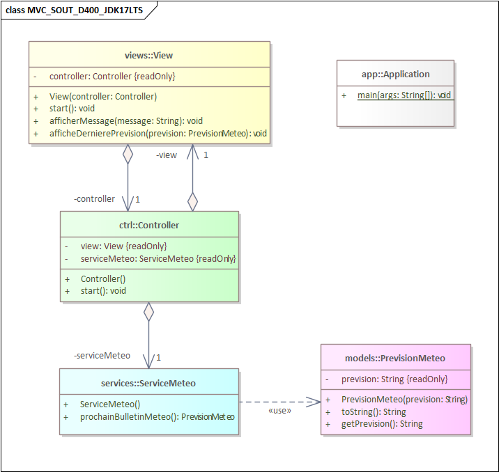

# MVC_SOUT_D400_JDK17LTS
## C'est quoi ?
C'est un template Visual Studio Code pour des projets et/ou exercices Java dès le D400 :
- Basé sur JDK-17-LTS
- Utilise le pattern MVC décidé en GT-DEV 2023
- Pas d'utilisation d'interfaces (elles sont vues au module ~~226a~~ 320)
- L'ihm utilisée est la console

**-> Utile dès le module D400 quand on veut une ihm super-simple**

## Vue d'ensemble UML du projet
### Détail des classes du projet - avec Entreprise Architect

### Détail des classes du projet - avec `mermaid`
Voici une vue d'ensemble du contenu de ce projet sous forme de diagramme UML en utilisant la notation `mermaid` (qui génère des diagrammes à la volée, dynamiquement).

### Les packages utilisés

### Détail des classes du projet - toutes les classes sur un schéma

